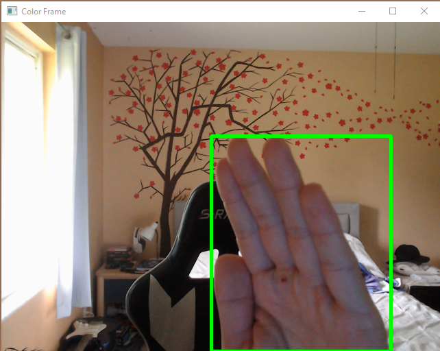
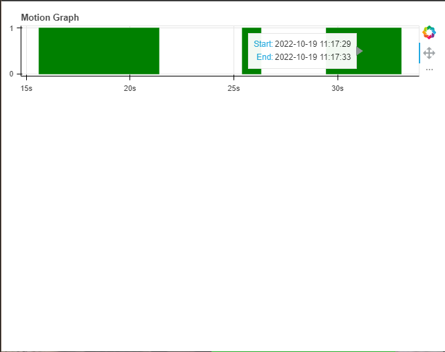

# Motion-Detection-with-Webcam
This program uses a webcam to capture when an object has entered and left its view and then display that data with a graph using bokeh. 
The main objective was to excercise the use of OpenCV, to capture and manipulate images, and Bokeh, to display a user friendly graph of data

To indicate an object has moved through the view of the camera, a green outline will be drawn around the object when it is present. 

 
 

When the program has been terminated it will create an html file that displays when an object entered and left the camera's view.
Green rectangles indicate when an object was present and when the mouse cursor hovers of the rectangle a pop will show the exact date and time 
through when the object moved through the camera.

 
